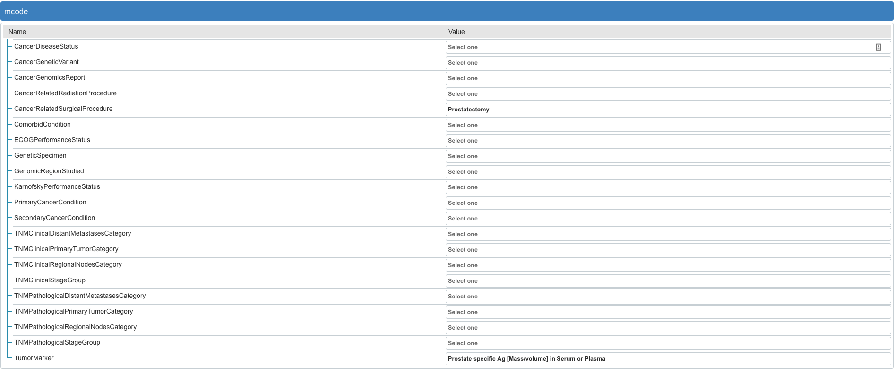

# abstraction-tool (work in progress)

React components for executing CQL snippets embedded in a FHIR Questionnaire and displaying resuts.



## Components

### Abstractor

This library exposes the `Abstractor` component to execute and render the FHIR Questionnaire with embedded CQL. The component takes the following `props`:

* patientData: R4.IBundle;
* library: any; (ELM JSON of the library used in the Questionnaire)
* valueSetMap: ValueSetMap;
* questionnaire: R4.IQuestionnaire;

See [the types directory](https://github.com/mcode/abstraction-tool/tree/master/src/types) for the custom types defined in the library.

``` JSX
// TODO: add import for Abstractor

function MyComponent() {
    return (
        <Abstractor
            valueSetMap={ /* a valueSet lookup */ }
            questionnaire={ /* a FHIR Questionnaire */ }
            library={ /* ELM JSON */ }
            patientData={ /* a FHIR bundle of patient data */ }
        />
    )
}
```

For the rendering of the updated questionnaire form to happen, you will need to include [LHC-Forms viewer widget](https://lhncbc.github.io/lforms/) by adding the following to `index.html`

``` html
<script crossorigin="anonymous" src="https://clinicaltables.nlm.nih.gov/lforms-versions/25.1.2/lforms.min.js"></script>

<script crossorigin="anonymous" src="https://clinicaltables.nlm.nih.gov/lforms-versions/25.1.2/fhir/lformsFHIRAll.min.js"></script>   
```

### Loaders

This library also exposes a variety of "loaders" which can be used to assemble the data necessary to provide the props to the `Abstractor`

* ValuesetLoader: Load FHIR ValueSets into a map provided to the CQL Execution Framework
* QuestionnaireLoader: Query for Questionnaire from FHIR server
* LibraryLoader: Parse ELM from FHIR library

``` JavaScript
// TODO: Add import statment examples for loaders

// Questionnaire Loader
const qLoader = new QuestionnaireLoader();
const questionnaire = await qLoader.getFromUrl(/* a url */);

// ValueSet loader
const fhirLibary = /* a FHIR library resource */;
const contextBundle = /* a bundle of FHIR valuesets */;
const vLoader = new ValueSetLoader(fhirLibrary, contextBundle);
const vsMap = await vLoader.seedValueSets();

// Library Loader
const fhirLibary2 = /* a FHIR library resource with CQL or ELM content */;
const lLoader = new LibraryLoader(fhirLibrary2)
const elm = await lLoader.fetchELM();
```

## Local Development

A simple demo of some cabability of the abstractor can be seen by running it as a standalone application.

``` bash
$ yarn install
$ yarn start
```
